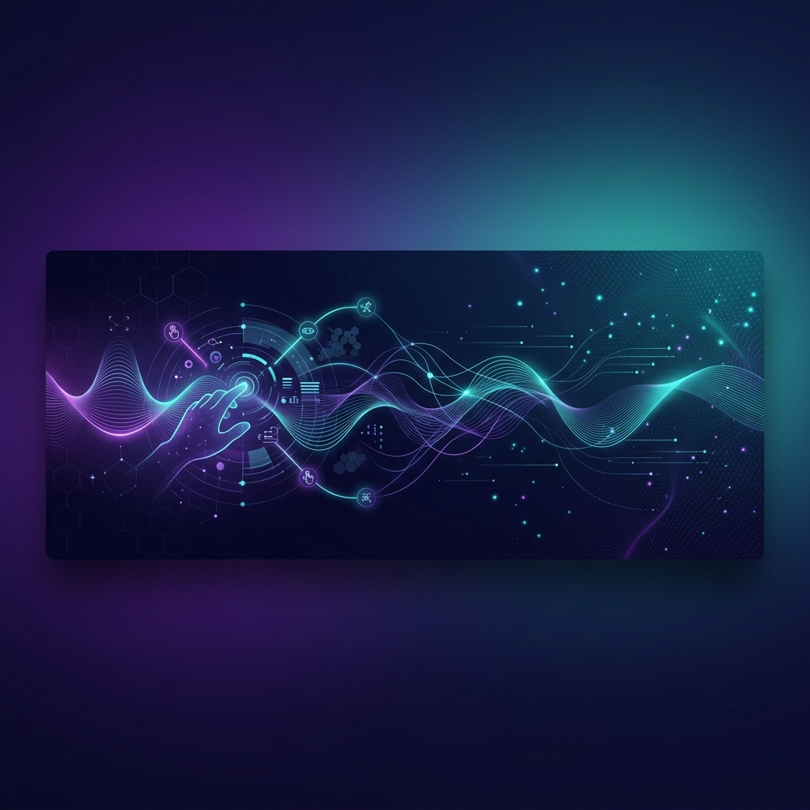

  

  # Hi there, I'm Aleph! 👋
  
  **Postdoctoral Research Fellow at Tampere University**
  
  
  
  

---

### 🔬 About Me

I am a **Postdoctoral Research Fellow** at the Faculty of Information Technology and Communication Sciences, **Tampere University**, Finland. I am affiliated with the **Tampere Unit for Computer-Human Interaction (TAUCHI)**. 

My work centers on **Human-Computer Interaction (HCI)**, with a deep focus on haptic devices, multisensory user interfaces, and the measurement of Quality of Experience (QoE) through physiological markers. I earned my **Ph.D. in Computer Science** from the **Federal University of Espírito Santo (UFES)** in Brazil.

- 🌬️ **Research Interests:** Multisensory HCI, Haptic & Thermal Interfaces, Wearable Devices, and Immersive Media (VR/AR).
- 🎮 **Usability Evaluation:** Deeply interested in the UX design of educational games and heuristic evaluation methodologies.
- ⚡ **Physical Computing:** Designing and prototyping hardware/software interfaces to bridge physical stimuli with digital environments.

---

### 🛠️ Technology Stack & Methodologies

  
<b>Languages & Software Development</b>

   
  
  
  
  
  
  

  
<b>Hardware, IoT & Wearables</b>

   
  
  
  
  

  
<b>Research Methods & Frameworks</b>

   
  
  
  
  

---

### 📂 Featured Projects

*   **[TWIRL System](https://github.com/PhelaPoscam)** ── A temperature-controlled DIY airflow system designed to deliver localized haptic and thermal feedback synchronized with immersive audio-visual content.
*   **[Nuanic & Moodmetric BLE Ring Python SDK](https://github.com/PhelaPoscam/Nuanic_Moodmetric_BLE)** ── A Python SDK to interface with biometric BLE rings (such as Moodmetric and Nuanic), facilitating the acquisition of real-time Electrodermal Activity (EDA) and PPG data for user experience and physiological computing research.
*   **E-Guess** ── An evaluation framework specifically designed for conducting heuristic usability assessments on educational games.

---

### 📚 Academic Profiles & Publications

Stay updated with my research and publications on these portals:

---

### 📊 GitHub Activity & Stats

  
  

---

### ✉️ Connect with Me

- 🏢 **Office:** Faculty of Information Technology and Communication Sciences, Tampere University, Finland.
- 📧 **Institutional Email:** [aleph.camposdasilveira@tuni.fi](mailto:aleph.camposdasilveira@tuni.fi)
- 📧 **Personal Email:** [alephcampos@gmail.com](mailto:alephcampos@gmail.com)
